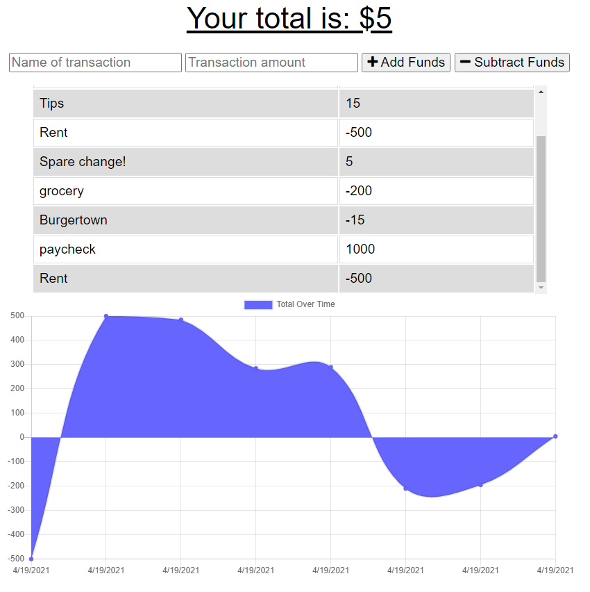

# budgeteer-offline


## Description
Track your budget online or off, conveniently on-the-go.

-----
## Table of Contents

* [Installation](#installation)
* [Usage](#usage)
* [License](#license)
* [Questions](#questions)


-----
## Installation
Install with ``` npm i ```

## Usage
To use the budgeteer, simply type in the name and value of a transaction and click Add or Subtract Funds. The amount will be added or subtracted from your total.

A handy graph will help you track your total spending over time.



-----


## Links
[Live application](https://budgeteer-offline.herokuapp.com/)

[Github repository](https://github.com/Athear/budgeteer-offline)


## License
Licensed under the [MIT](https://spdx.org/licenses/MIT.html) license.


## Questions
For additional questions, find me on [GitHub](https://github.com/athear)

